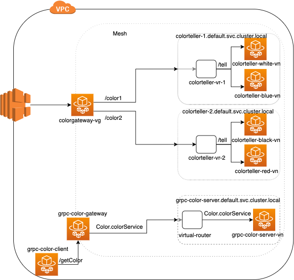

# Configuring Ingress Gateway

In this walkthrough we'll configure an Ingress Gateway in our existing [ColorApp](https://github.com/aws/aws-app-mesh-examples/tree/master/examples/apps/colorapp) example but with a VirtualGateway resource to configure the ColorGateway instead of a VirtualNode.

## Introduction

In App Mesh, VirtualGateway and GatewayRoutes are the front door to the Mesh and are configured to route traffic to VirtualServices within the Mesh. App Mesh transforms these resources to configure the Envoy at the gateway.

- **VirtualGateway:** This is where customers will define the Listener configuration for the Ingress gateway. Apart from Port Mapping, Listener also supports specifying configuration for TLS termination, Health Check and Access Logging. Customers can also specify defaults for backends at the VirtualGateway. Therefore, The VirtualGateway supports TLS termination for incoming traffic and TLS initiation for traffic from VirtualGateway to target VirtualNodes. A sample spec for the VirtualGateway is as follows:

	```json
	{
		"spec": {
			"listeners": [{
				"portMapping": {
					"port": 9080,
					"protocol": "http"
				},
				"tls": {
					"mode": "STRICT",
					"certificate": {
						"acm": {
							"certificateArn": $CERTIFICATE_ARN
						}
					}
				}
			}],
			"backendDefaults": {
				"clientPolicy": {
					"tls": {
						"validation": {
							"trust": {
								"acm": {
									"certificateAuthorityArns": [
										$ROOT_CA_ARN
									]
								}
							}
						}
					}
				}
			}
		}
	}
	```
	Here, Mode determines whether or not TLS is negotiated on this Virtual Node:
	- STRICT- TLS is required.
	- PERMISSIVE- TLS is optional (plain-text allowed).
	- DISABLED- TLS is disabled (plain-text only).

	BackendDefaults settings are applied to all backends with ClientPolicy being policy for how to handle traffic with backends (i.e. from the client perspective).
	
	- TLS determines whether or not TLS is negotiated, and how.
	- Validation determines how to validate a certificate offered by a backend.
	- Trust is the trust bundle (i.e. set of root certificate authorities) used to validate the certificate offered by a backend. Certificates signed by one of these certificate authorities are considered valid.

- **GatewayRoute:** This is where customers will specify routing configuration for backend VirtualServices. VirtualGateway supports HTTP, HTTP2 and GRPC GatewayRoutes. For each type of GatewayRoute customers can specify a match condition (prefix for HTTP/HTTP2 and service name for GRPC) and a target Virtual Service name. A sample spec for the GatewayRoute is as follows:

	```json
	{
    "spec": {
        "httpRoute" : {
            "match" : {
                "prefix" : "/color1"
            },
            "action" : {
                "target" : {
                    "virtualService": {
                        "virtualServiceName": $VIRTUALSERVICE_NAME
                    }
                }
            }
        }
    }
	}
	```

In this example, we'll use an NLB to forward traffic to the Gateway. The Gateway will be configured to terminate TLS for the incoming traffic and we'll later introduce the Client Policy at the Gateway to enforce TLS initiation. The flow therefore would be:

```
Internet --> (terminate TLS) NLB (originate TLS) --> (terminate TLS) Gateway (originate TLS) --> (terminate TLS) Virtual Nodes
```



 Let's now jump into an example of App Mesh Ingress in action.

## Step 1: Prerequisites

You will need the latest version of the App Mesh Preview CLI for this walkthrough. You can download and use the latest version using the command below.

```bash
aws configure add-model \
        --service-name appmesh-preview \
        --service-model https://raw.githubusercontent.com/aws/aws-app-mesh-roadmap/master/appmesh-preview/service-model.json
```
You'll also need a keypair stored in AWS to access a bastion host. You can create a keypair using the command below if you don't have one. See [Amazon EC2 Key Pairs](https://docs.aws.amazon.com/AWSEC2/latest/UserGuide/ec2-key-pairs.html).

```bash
aws ec2 create-key-pair --key-name color-app | jq -r .KeyMaterial > ~/.ssh/color-app.pem
chmod go-r ~/.ssh/color-app.pem
```

This command creates an Amazon EC2 Key Pair with name `color-app` and saves the private key at
`~/.ssh/color-app.pem`.

Additionally, this walkthrough makes use of the unix command line utility `jq`. If you don't already have it, you can install it from [here](https://stedolan.github.io/jq/).

## Step 2: Set Environment Variables
We need to set a few environment variables before provisioning the
infrastructure. Please change the value for `AWS_ACCOUNT_ID`, `KEY_PAIR_NAME`, and `ENVOY_IMAGE` below.

```bash
export AWS_ACCOUNT_ID=<your account id>
export KEY_PAIR_NAME=<color-app or your SSH key pair stored in AWS>
export AWS_DEFAULT_REGION=us-west-2
export ENVIRONMENT_NAME=AppMeshIngressExample
export MESH_NAME=ColorApp-Ingress
export ENVOY_IMAGE=<get the latest from https://docs.aws.amazon.com/app-mesh/latest/userguide/envoy.html>
export SERVICES_DOMAIN="default.svc.cluster.local"
export COLOR_TELLER_IMAGE_NAME="howto-ingress/colorteller"
```

## Step 3: Generate Certificate from ACM

Before we can encrypt traffic between NLB --> VirtualGateway and VirtualGateway --> VirtualNodes, we need to generate a certificate. App Mesh currently supports certificates issued by an ACM Private Certificate Authority, which we'll setup in this step. We'll use this ACM certificate to terminate TLS at the NLB, the VirtualGateway and the target VirtualNodes.

Refer [Configuring TLS with AWS Certificate Manager](https://github.com/aws/aws-app-mesh-examples/tree/master/walkthroughs/tls-with-acm) walkthrough for information about what permissions does the IAM role used by Envoy need in order to retrieve a certificate and private key from ACM and retrieve a Certificate Authority Certificate.

Start by creating a root certificate authority (CA) in ACM.

>You pay a monthly fee for the operation of each AWS Certificate Manager Private Certificate Authority until you delete it and you pay for the private certificates you issue each month. For more information, see [AWS Certificate Manager Pricing](https://aws.amazon.com/certificate-manager/pricing/).

```bash
export ROOT_CA_ARN=`aws acm-pca create-certificate-authority \
    --certificate-authority-type ROOT \
    --certificate-authority-configuration \
    "KeyAlgorithm=RSA_2048,
    SigningAlgorithm=SHA256WITHRSA,
    Subject={
        Country=US,
        State=WA,
        Locality=Seattle,
        Organization=App Mesh Examples,
        OrganizationalUnit=Ingress Example,
        CommonName=${SERVICES_DOMAIN}}" \
        --query CertificateAuthorityArn --output text`
```
Next you need to self-sign your root CA. Start by retrieving the CSR contents:

```bash
ROOT_CA_CSR=`aws acm-pca get-certificate-authority-csr \
    --certificate-authority-arn ${ROOT_CA_ARN} \
    --query Csr --output text`
```
Sign the CSR using itself as the issuer:

```bash
ROOT_CA_CERT_ARN=`aws acm-pca issue-certificate \
    --certificate-authority-arn ${ROOT_CA_ARN} \
    --template-arn arn:aws:acm-pca:::template/RootCACertificate/V1 \
    --signing-algorithm SHA256WITHRSA \
    --validity Value=10,Type=YEARS \
    --csr "${ROOT_CA_CSR}" \
    --query CertificateArn --output text`
```
Then import the signed certificate as the root CA:

```bash
ROOT_CA_CERT=`aws acm-pca get-certificate \
    --certificate-arn ${ROOT_CA_CERT_ARN} \
    --certificate-authority-arn ${ROOT_CA_ARN} \
    --query Certificate --output text`

aws acm-pca import-certificate-authority-certificate \
    --certificate-authority-arn $ROOT_CA_ARN \
    --certificate "${ROOT_CA_CERT}"
```
We also want to grant permissions to the CA to automatically renew the managed certificates it issues:

```bash
aws acm-pca create-permission \
    --certificate-authority-arn $ROOT_CA_ARN \
    --actions IssueCertificate GetCertificate ListPermissions \
    --principal acm.amazonaws.com
```
Now you can request a managed certificate from ACM using this CA:

```bash
export CERTIFICATE_ARN=`aws acm request-certificate \
    --domain-name "*.${SERVICES_DOMAIN}" \
    --certificate-authority-arn ${ROOT_CA_ARN} \
    --query CertificateArn --output text`
```
With managed certificates, ACM will automatically renew certificates that are nearing the end of their validity, and App Mesh will automatically distribute the renewed certificates. See [Managed Renewal and Deployment](https://aws.amazon.com/certificate-manager/faqs/#Managed_Renewal_and_Deployment) for more information.

## Step 4: Create Color App Infrastructure

We'll start by setting up the basic infrastructure for our services. All commands will be provided as if run from the same directory as this README.

First, create the VPC.

```bash
./infrastructure/vpc.sh
```

Next, create the ECS cluster and ECR repositories.

```bash
./infrastructure/ecs-cluster.sh
./infrastructure/ecr-repositories.sh
```

Finally, build and deploy the colorteller image.

```bash
./src/colorteller/deploy.sh
```
Note that the example apps use go modules. If you have trouble accessing https://proxy.golang.org during the deployment you can override the GOPROXY by setting `GO_PROXY=direct`

```bash
GO_PROXY=direct ./src/colorteller/deploy.sh
```

## Step 5: Create a Mesh

This mesh is a variation of the original Color App Example, so we have four colorteller services all returning different colors (white, blue, red and black). These VirtualNodes will be target for two VirtualServices which will be exposed to clients outside the mesh via a colorgateway which is a VirtualGateway. Both the virtualServices will routed from virtualGateway using two gatewayRoutes matching on different prefixes. The spec for the VirtualGateway looks like this:

```json
{
  "spec": {
    "listeners": [
      {
        "portMapping": {
          "port": 9080,
          "protocol": "http"
        }
      }
    ]
  }
}
```
There are two HTTP GatewayRoutes attached to this VirtualGateway one for each VirtualService backend. One of the gatewayRoute will match on prefix `/color1` and other will match on prefix `/color2`. The spec for one of the GatewayRoutes is follows:

```json
{
"spec": {
    "httpRoute" : {
        "match" : {
            "prefix" : "/color1"
        },
        "action" : {
            "target" : {
                "virtualService": {
                    "virtualServiceName": "colorteller-1.${SERVICES_DOMAIN}"
                }
            }
        }
    }
}
}
```
Both the VirtualServices are provided by VirtualRouter which routes the traffic matching on prefix `/tell` to equal weight target VirtualNodes. The spec for one of the service route is as follows:

```json
{
    "spec": {
        "httpRoute": {
            "action": {
                "weightedTargets": [
                    {
                        "virtualNode": "colorteller-white-vn",
                        "weight": 1
                    },
                    {
                        "virtualNode": "colorteller-blue-vn",
                        "weight": 1
                    }
                ]
            },
            "match": {
                "prefix": "/tell"
            }
        }
    }
}
```

Let's create the mesh.

```bash
./mesh/mesh.sh up
```

## Step 6: Deploy and Verify

Our next step is to deploy the service in ECS and test it out.

```bash
./infrastructure/ecs-service.sh
```

1. After a few minutes, the applications should be deployed and you will see an output such as:

	```bash
	Successfully created/updated stack - ${ENVIRONMENT_NAME}-ecs-service
	Bastion endpoint:
	12.345.6.789
	ColorApp endpoint:
	http://howto-Publi-55555555.us-west-2.elb.amazonaws.com
	```

	Since, we have enabled TLS termination at the NLB, we'll use `https` in our curl request and use `-k` option to accept the cert without validation. Export the public endpoint to access the gateway replacing `http` with `https`.
	
	```bash
	export COLORAPP_ENDPOINT=<your_https_colorApp_endpoint e.g. https://howto-Publi-55555555.us-west-2.elb.amazonaws.com>
	```
	And export the bastion endpoint for use later.
	
	```bash
	export BASTION_IP=<your_bastion_endpoint e.g. 12.245.6.189>
	```
	
2. Let's issue a request to the color gateway with gatewayRoute prefix as `/color1` and backend service route prefix as `/tell`.

	```bash
	curl -k "${COLORAPP_ENDPOINT}/color1/tell"
	```
	If you run above command several time you should see successful `white` and `blue` responses back from `colorteller-white-vn` and `colorteller-blue-vn` virtualNodes respectively. These are both the targets for `colorteller-2.${SERVICES_DOMAIN}` VirtualService.
	
	Similarly, let's issue a request to the gateway with gatewayRoute prefix as `/color2` and backend service route prefix as `/tell`.
	
	```bash
	curl -k "${COLORAPP_ENDPOINT}/color2/tell"
	```
	In this case, you should receive `black` and `red` responses back from targets of `colorteller-2.${SERVICES_DOMAIN}` VirtualService.
	
3. Now let's log in to the bastion host and see ssl handshake stats for the gateway envoy.

	```bash
	ssh -i <key_pair_location> ec2-user@$BASTION_IP
	```
	We'll curl Envoy's stats endpoint to verify ssl handshake (replace default.svc.cluster.local in the below command with the value of $SERVICES_DOMAIN environment variable)

	```bash
	curl -s http://colorgateway.default.svc.cluster.local:9901/stats | grep ssl.handshake
	```
You should see output similar to: `listener.0.0.0.0_9080.ssl.handshake: 1`, indicating a successful SSL handshake was achieved between the NLB and the gateway.

## Step 7: Initiate TLS at the Gateway

We'll now be encrypting traffic from the gateway to the colorteller white VirtualNode. Our colorteller white will be terminating TLS with a certificate provided by ACM. The spec looks like this:

```json
{
    "spec": {
          "listeners": [
             {
                "healthCheck": {
                   "healthyThreshold": 2,
                   "intervalMillis": 5000,
                   "path": "/ping",
                   "protocol": "http",
                   "timeoutMillis": 2000,
                   "unhealthyThreshold": 2
                },
                "portMapping": {
                   "port": 9080,
                   "protocol": "http"
                },
                "tls": {
                    "mode": "STRICT",
                    "certificate": {
                        "acm": {
                            "certificateArn": $CERTIFICATE_ARN
                        }
                    }
                }
             }
          ],
          "serviceDiscovery": {
             "dns": {
                "hostname": $DNS_HOSTNAME
             }
          }
    }
}
```
Additionally, the VirtualGateway will be configured to validate the certificate of the colorteller node by specifying the CA that issued it. The spec for colorgateway looks like this:

```json
{
	"spec": {
		"listeners": [{
			"portMapping": {
				"port": 9080,
				"protocol": "http"
			},
			"tls": {
				"mode": "STRICT",
				"certificate": {
					"acm": {
						"certificateArn": $CERTIFICATE_ARN
					}
				}
			}
		}],
		"backendDefaults": {
			"clientPolicy": {
				"tls": {
					"validation": {
						"trust": {
							"acm": {
								"certificateAuthorityArns": [
									$ROOT_CA_ARN
								]
							}
						}
					}
				}
			}
		}
	}
}
```
Let's update the `colorteller-white-vn` VirtualNode:

```bash
cli_input=$( jq -n \
        --arg DNS_HOSTNAME "colorteller-white.${SERVICES_DOMAIN}" \
        --arg CERTIFICATE_ARN "${CERTIFICATE_ARN}" \
        -f "./mesh/colorteller-white-vn-tls.json" )

aws appmesh --endpoint-url ${APPMESH_FRONTEND} update-virtual-node \
                --mesh-name "${MESH_NAME}" \
                --virtual-node-name "colorteller-white-vn" \
                --cli-input-json "${cli_input}"    
```

Now update the `colorgateway-vg` VirtualGateway:

```bash
cli_input=$( jq -n \
        --arg CERTIFICATE_ARN "${CERTIFICATE_ARN}" \
        --arg ROOT_CA_ARN "${ROOT_CA_ARN}" \
        -f "./mesh/colorgateway-vg-backendDefaults.json" )

aws appmesh --endpoint-url ${APPMESH_FRONTEND} update-virtual-gateway \
                --mesh-name "${MESH_NAME}" \
                --virtual-gateway-name "colorgateway-vg" \
                --cli-input-json "${cli_input}"
```

### Verify TLS
Issue a request to the color gateway with prefix `/color1` to get encrypted response from `colorteller-white-vn`.

```bash
curl -k "${COLORAPP_ENDPOINT}/color1/tell"
```
If you run above command several times, you should see successful `white` response from only the `colorteller-white-vn` virtual node and a connection error as below for the `colorteller-blue-vn` virtual node.

```
upstream connect error or disconnect/reset before headers. reset reason: connection failure%
```
Similarly, try to curl `colorteller-black-vn` and `colorteller-blue-vn` virtualNodes and verify we get a connection error as these virtualNodes don't have tls configuration at the listener.

```bash
curl -k "${COLORAPP_ENDPOINT}/color2/tell"
```

Now, we'll enable TLS at the listener of other colorteller nodes too. Run the following commands to enable TLS at listener for `colorteller-blue-vn`, `colorteller-black-vn` and `colorteller-red-vn`.

**colorteller-blue-vn**

```bash
cli_input=$( jq -n \
        --arg DNS_HOSTNAME "colorteller-blue.${SERVICES_DOMAIN}" \
        --arg CERTIFICATE_ARN "${CERTIFICATE_ARN}" \
        -f "./mesh/colorteller-blue-vn-tls.json" )

aws appmesh --endpoint-url ${APPMESH_FRONTEND} update-virtual-node \
                --mesh-name "${MESH_NAME}" \
                --virtual-node-name "colorteller-blue-vn" \
                --cli-input-json "${cli_input}"
```
**colorteller-black-vn**

```bash
cli_input=$( jq -n \
        --arg DNS_HOSTNAME "colorteller-black.${SERVICES_DOMAIN}" \
        --arg CERTIFICATE_ARN "${CERTIFICATE_ARN}" \
        -f "./mesh/colorteller-black-vn-tls.json" )

aws appmesh --endpoint-url ${APPMESH_FRONTEND} update-virtual-node \
                --mesh-name "${MESH_NAME}" \
                --virtual-node-name "colorteller-black-vn" \
                --cli-input-json "${cli_input}"
```
**colorteller-red-vn**

```bash
cli_input=$( jq -n \
        --arg DNS_HOSTNAME "colorteller-red.${SERVICES_DOMAIN}" \
        --arg CERTIFICATE_ARN "${CERTIFICATE_ARN}" \
        -f "./mesh/colorteller-red-vn-tls.json" )

aws appmesh --endpoint-url ${APPMESH_FRONTEND} update-virtual-node \
                --mesh-name "${MESH_NAME}" \
                --virtual-node-name "colorteller-red-vn" \
                --cli-input-json "${cli_input}"
```

Now again let's send curl requests to all colortellers to verify that the encrypted traffic flows between all the virtualNodes and the virtualGateway.

```bash
curl -k "${COLORAPP_ENDPOINT}/color1/tell"
curl -k "${COLORAPP_ENDPOINT}/color2/tell"
```

Finally, let's log in to the bastion host again and check the SSL handshake statistics for the gateway envoy.

```bash
ssh -i <key_pair_location> ec2-user@$BASTION_IP
```
We'll curl Envoy's stats endpoint to verify ssl handshake (replace default.svc.cluster.local in the below command with the value of $SERVICES_DOMAIN environment variable)

```bash
curl -s http://colorgateway.default.svc.cluster.local:9901/stats | grep ssl.handshake
```
You should see output similar to following, indicating a successful SSL handshake was achieved between the gateway and the colorteller nodes:

```bash
cluster.cds_egress_New-ColorApp-Ingress_colorteller-black-vn_http_9080.ssl.handshake: 3
cluster.cds_egress_New-ColorApp-Ingress_colorteller-blue-vn_http_9080.ssl.handshake: 3
cluster.cds_egress_New-ColorApp-Ingress_colorteller-red-vn_http_9080.ssl.handshake: 3
cluster.cds_egress_New-ColorApp-Ingress_colorteller-white-vn_http_9080.ssl.handshake: 5
listener.0.0.0.0_9080.ssl.handshake: 60
```

That's it! We've encrypted traffic from our gateway to our colorteller nodes using a certificate from ACM.

## Step 8: Test Grpc Routing at Gateway
We'll now add a Grpc service to the Mesh and then verify the routing by using a Grpc Client to send request to the server via gateway.

**Grpc Color Server**
The Color Server is a gRPC server that implements [color.ColorService](https://github.com/karanvasnani/aws-app-mesh-examples/tree/master/walkthroughs/howto-ingress-gateway/color.proto). Additionally, it implements the [gRPC Health Checking Protocol](https://github.com/grpc/grpc/blob/master/doc/health-checking.md) which we will configure App Mesh to use as the health check for its virtual-nodes. It implements methods like `getColor` and `setColor`.

**Grpc Color Client**
The Color Client is a HTTP/1.1 front-end webserver that maintains a persistent gRPC connection to the Color Server. It forwards requests to /getColor and /setColor to the same methods in [color.ColorService](https://github.com/karanvasnani/aws-app-mesh-examples/tree/master/walkthroughs/howto-ingress-gateway/color.proto). This Color Client will be deployed in the VPC but, will not be a part of the Mesh. It will be used to send requests to Color Server inside the Mesh via the Gateway.

Deploy the Grpc Services in the Cluster

```bash
./infrastructure/grpc-ecs-service.sh
```

Add the `grpc-color-server-vn` VirtualNode with spec as follows:

```json
{
    "spec": {
      "listeners": [
        {
          "portMapping": {
            "port": 9080,
            "protocol": "grpc"
          }
        }
      ]
    }
}
```
Now, add the `grpc-color-gateway-vg` VirtualGateway to the Mesh with spec as:

```json
{
    "spec": {
        "listeners": [
            {
                "healthCheck": {
                    "healthyThreshold": 2,
                    "intervalMillis": 5000,
                    "port": 9080,
                    "protocol": "grpc",
                    "timeoutMillis": 2000,
                    "unhealthyThreshold": 3
                },
                "portMapping": {
                    "port": 9080,
                    "protocol": "grpc"
                }
            }
        ],
        "serviceDiscovery": {
            "dns": {
                "hostname": $DNS_HOSTNAME
            }
        }
    }
}
```

We'll also add a GatewayRoute that matches on `serviceName=color.ColorService` and forwards the request to the VirtualService. And a service Route that matches on `serviceName=color.ColorService` and all methods will be created with color-server-vn as target.

Let's add these resources to the Mesh.

```bash
./mesh/mesh.sh grpc_up
```

Now we can verify this connection by sending an http curl request to color client with path as `/getColor`. The Color Client should forward this request to `color.ColorService` at `GetColor` method.

Copy the output of the below command as we'll use this as hostname in following commands (e.g., copy `default.svc.cluster.local`)

```bash
echo $SERVICES_DOMAIN
```
ssh into your bastion host.

```bash
ssh -i <key_pair_location> ec2-user@$BASTION_IP
```

Now, we'll send a curl request to grpc-color-client service. Replace the default.svc.cluster.local with the value of $SERVICES_DOMAIN environment variable in the below command.

```bash
curl grpc-color-client.default.svc.cluster.local:9080/getColor
```
You should see a response as `no-color`.

Now let's call `/setColor` method of `color.ColorService` to set the color as green and then verify by calling `getColor` again.

```bash
curl -i -X POST -d "green" grpc-color-client.default.svc.cluster.local:9080/setColor
```
You should see an output like following:

```bash
HTTP/1.1 200 OK
Date: Thu, 02 Apr 2020 06:34:16 GMT
Content-Length: 8
Content-Type: text/plain; charset=utf-8
no_color
```
Now let's verify if the color was set to `green`

```
curl grpc-color-client.default.svc.cluster.local:9080/getColor
```

## Step 9: Clean Up

If you want to keep the application running, you can do so, but this is the end of this walkthrough.
Run the following commands to clean up and tear down the resources that we’ve created.

Delete the CloudFormation stacks:

```bash
aws cloudformation delete-stack --stack-name $ENVIRONMENT_NAME-ecs-service
aws cloudformation delete-stack --stack-name $ENVIRONMENT_NAME-grpc-ecs-service
aws cloudformation delete-stack --stack-name $ENVIRONMENT_NAME-ecs-cluster
aws ecr delete-repository --force --repository-name colorteller
aws cloudformation delete-stack --stack-name $ENVIRONMENT_NAME-ecr-repositories
aws cloudformation delete-stack --stack-name $ENVIRONMENT_NAME-vpc
```
Delete the Mesh:

```bash
./mesh/mesh.sh grpc_down
./mesh/mesh.sh down
```
And finally delete the certificates.

```bash
aws acm delete-certificate --certificate-arn $CERTIFICATE_ARN
aws acm-pca update-certificate-authority --certificate-authority-arn $ROOT_CA_ARN --status DISABLED
aws acm-pca delete-certificate-authority --certificate-authority-arn $ROOT_CA_ARN
```